# **LAMP STACK IMPLEMENTATION ON AWS**

## **STEP 1 — INSTALLING APACHE AND UPDATING THE FIREWALL**
This is a web server installed to serve your contents. 

The first thing to do is to update the linux package repository with the command below:

`sudo apt update`

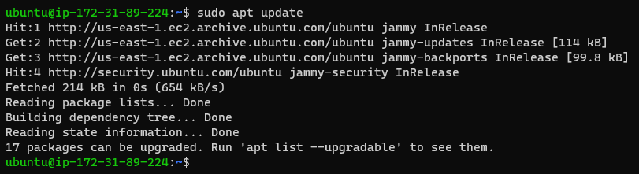

Run apache2 package installation

`sudo apt install apache2`


Verify that apache2 is running as a service in our OS

`sudo systemctl status apache2`


If it is green and running, you've done everything right!
**Kudus to you! You have just launched your first Web Server in the Cloud!**

Before you can receive any traffic on your Web Server, you need make sure your security group settings on AWS allows TCP port 80 traffic (HTTP).

You can try to check if it is locally running on your Ubuntu terminal using the following commands

`curl http://localhost:80` **(Acccessing through DNS)**

`curl http://127.0.0.1:80` **(Accessing through the IP address)**

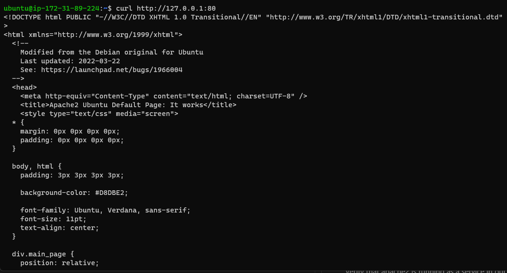

Next step to take is to test how your Apache HTTP server can respond to requests from the Internet.

Open a web browser of your choice and try to access following url

`http://<Public-IP-Address>` **(Public Address example: 55.11.22.226)**

Kindly check your AWS console to get your public IP address

If you see the page below, your web server has been properly installed and is now accessible through your firewall.


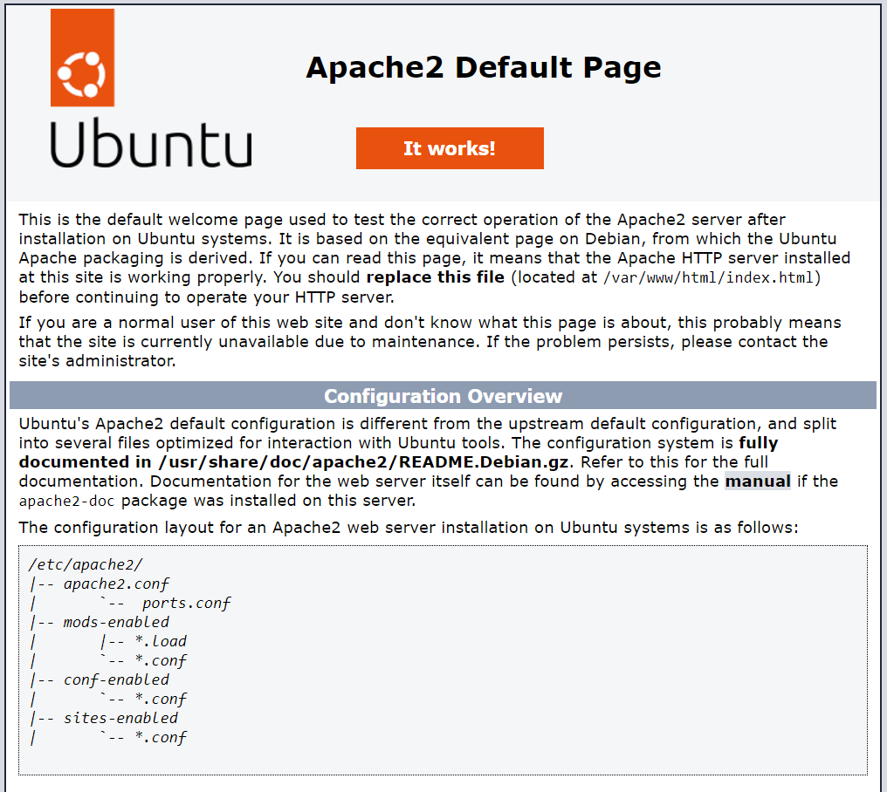


## **STEP 2 - INSTALLING MYSQL (DBMS)**
Now that you have a web server running, you need a database to manage the data. To install the Database, use the command below:

`sudo apt install mysql-server`

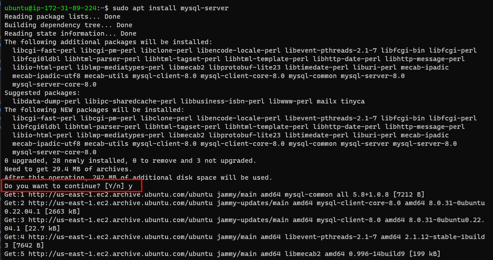

*When prompted as highlighted with the red rectangle above, confirm installation by typing y, and then hit ENTER.*

When the installation is complete, open the MySQL console by typing:

`sudo mysql`

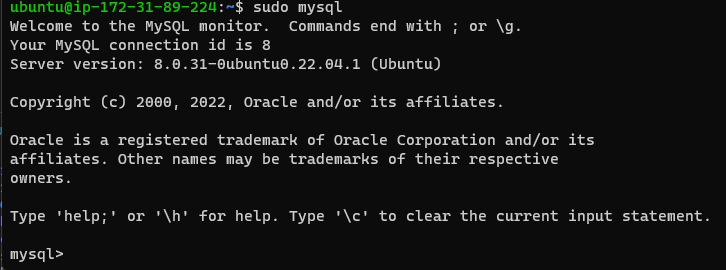

*The use of sudo while running this command implies that it will connect to the MySQL server as the administrator database user root.*

Running the security script that comes pre-installed with MySQL is highly advised. This script will lock down access to your database system and remove several unsafe default settings. You must create a password for the root user before executing the script, with mysql_native_password serving as the default authentication method. The password for this user is defined as PassWord.1.

`ALTER USER 'root'@'localhost' IDENTIFIED WITH mysql_native_password BY 'PassWord.1';`

Exit the MySQL shell with the `exit` command

Next step is to start the interactive script by running:

`sudo mysql_secure_installation`

After entering the root password, you will be asked if you want to configure the VALIDATE PASSWORD PLUGIN. Simply answer "y" for yes.

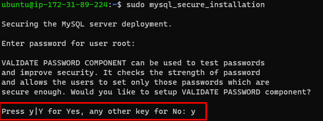

You will now be prompted to choose a password validation level. Remember that if you choose the strongest level of 2 and try to make a password that doesn't include numbers, upper and lowercase letters, special characters, you will get errors.


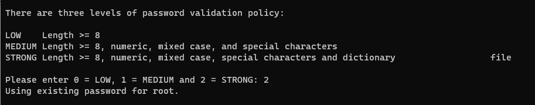

If you enabled password validation, you’ll be shown the password strength for the root password you just entered and your server will ask if you want to continue with that password. If you are happy with your current password, enter Y for “yes” at the prompt:

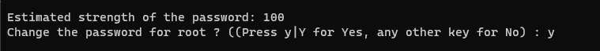

For the rest of the questions, **press Y and hit the ENTER key at each prompt.** This will prompt you to change the root password, remove some anonymous users and the test database, disable remote root logins, and load these new rules so that MySQL immediately respects the changes you have made.

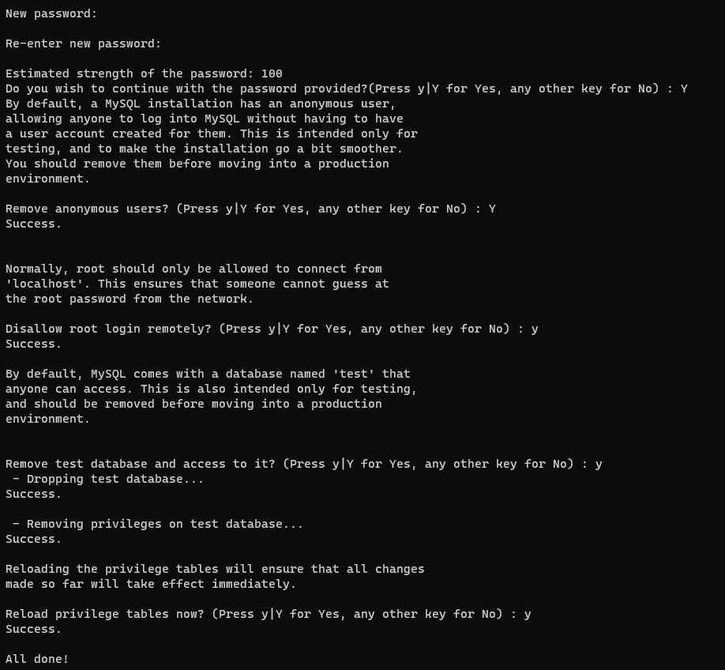

When you’re finished, test if you’re able to log in to the MySQL console by typing:

`sudo mysql -p`

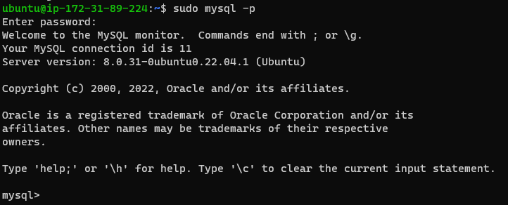

Notice the -p flag in this command, which will prompt you for the password used after changing the root user password. NOTE: If you don't use the "-p", you'll get the error message as seen below

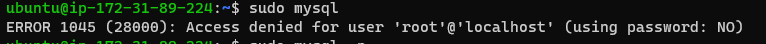

To exit the MySQL console, type: `exit`

Your MySQL server is now installed and secured. Next, we will install PHP, the final component in the LAMP stack.

## **STEP 3 — INSTALLING PHP**

PHP is the component of our setup that will process code to display dynamic content to the end user. In addition to the php package, you’ll need php-mysql, a PHP module that allows PHP to communicate with MySQL-based databases. You’ll also need libapache2-mod-php to enable Apache to handle PHP files. Core PHP packages will automatically be installed as dependencies.

To install these 3 packages at once, run:

`sudo apt install php libapache2-mod-php php-mysql`

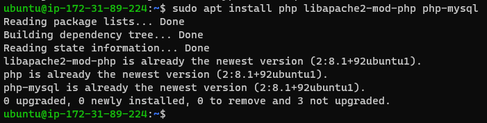

Once the installation is finished, you can run the following command to confirm your PHP version: `php -v`

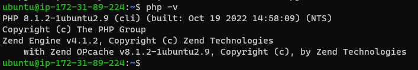

At this point, your LAMP stack is completely installed and fully operational.
- Linux (Ubuntu)
- Apache HTTP Server
- MySQL
- PHP

To test your setup with a PHP script, it’s best to set up a proper Apache Virtual Host to hold your website’s files and folders. Virtual host allows you to have multiple websites located on a single machine and users of the websites will not even notice it.

We will configure our first Virtual Host in the next step.

## **STEP 4 — CREATING A VIRTUAL HOST FOR YOUR WEBSITE USING APACHE**

In this project, you will set up a domain called projectlamp, but you can replace this with any domain of your choice.

Apache on Ubuntu 20.04 has one server block enabled by default that is configured to serve documents from the /var/www/html directory. 

We will leave this configuration as is and will add our own directory next to the default one.

- Create the directory for projectlamp using ‘mkdir’ command as follows:

`sudo mkdir /var/www/projectlamp`

- Next, assign ownership of the directory with your current system user:

 `sudo chown -R $USER:$USER /var/www/projectlamp`

 - Then, create and open a new configuration file in Apache’s sites-available directory using your preferred command-line editor. Here, we’ll be using vi or vim (They are the same by the way):

 `sudo vi /etc/apache2/sites-available/projectlamp.conf`

This will create a new blank file. Paste in the following bare-bones configuration by hitting on i on the keyboard to enter the insert mode, and paste the text:

 ```
 <VirtualHost *:80>
    ServerName projectlamp
    ServerAlias www.projectlamp 
    ServerAdmin webmaster@localhost
    DocumentRoot /var/www/projectlamp
    ErrorLog ${APACHE_LOG_DIR}/error.log
    CustomLog ${APACHE_LOG_DIR}/access.log combined
</VirtualHost>
```

To save and close the file, simply follow the steps below:
1. Hit the esc button on the keyboard
2. Type **:**
3. Type wq. **w for write and q for quit**
4. Hit **ENTER** to save the file

You can use the **ls** command to show the new file in the sites-available directory

`sudo ls /etc/apache2/sites-available`

You will see something like this: **000-default.conf default-ssl.conf  projectlamp.conf**

With this VirtualHost configuration, we’re telling Apache to serve projectlamp using **/var/www/projectlampl as its web root directory.** If you would like to test Apache without a domain name, you can remove or comment out the options ServerName and ServerAlias by adding a # character in the beginning of each option’s lines. Adding the # character there will tell the program to skip processing the instructions on those lines.

You can now use a2ensite command to enable the new virtual host:

`sudo a2ensite projectlamp`

You might want to disable the default website that comes installed with Apache. This is required if you’re not using a custom domain name, because in this case Apache’s default configuration would overwrite your virtual host. To disable Apache’s default website use a2dissite command, type:

`sudo a2dissite 000-default`

To make sure your configuration file doesn’t contain syntax errors, run:

`sudo apache2ctl configtest`

Finally, reload Apache so these changes take effect:

`sudo systemctl reload apache2`

Your new website is now active, but the web root /var/www/projectlamp is still empty. Create an index.html file in that location so that we can test that the virtual host works as expected:

```
sudo echo 'Hello LAMP from hostname' $(curl -s http://169.254.169.254/latest/meta-data/public-hostname) 'with public IP' $(curl -s http://169.254.169.254/latest/meta-data/public-ipv4) > /var/www/projectlamp/index.html
```

Now go to your browser and try to open your website URL using IP address:

`http://<Public-IP-Address>:80`

If you see the text from ‘echo’ command you wrote to index.html file, then it means your Apache virtual host is working as expected.


In the output you will see your server’s public hostname (DNS name) and public IP address. You can also access your website in your browser by public DNS name, not only by IP – try it out, the result must be the same (port is optional)

`http://<Public-DNS-Name>:80`

You can leave this file in place as a temporary landing page for your application until you set up an index.php file to replace it. Once you do that, remember to remove or rename the index.html file from your document root, as it would take precedence over an index.php file by default.


## **STEP 5 — ENABLE PHP ON THE WEBSITE**

With the default DirectoryIndex settings on Apache, a file named index.html will always take precedence over an index.php file. This is useful for setting up maintenance pages in PHP applications, by creating a temporary index.html file containing an informative message to visitors. Because this page will take precedence over the index.php page, it will then become the landing page for the application. Once maintenance is over, the index.html is renamed or removed from the document root, bringing back the regular application page.

In case you want to change this behavior, you’ll need to edit the /etc/apache2/mods-enabled/dir.conf file and change the order in which the index.php file is listed within the DirectoryIndex directive:

```
sudo vim /etc/apache2/mods-enabled/dir.conf
<IfModule mod_dir.c>
        #Change this:
        #DirectoryIndex index.html index.cgi index.pl index.php index.xhtml index.htm
        #To this:
        DirectoryIndex index.php index.html index.cgi index.pl index.xhtml index.htm
</IfModule>
```

After saving and closing the file, you will need to reload Apache so the changes take effect:

`sudo systemctl reload apache2`

Finally, we will create a PHP script to test that PHP is correctly installed and configured on your server.

Now that you have a custom location to host your website’s files and folders, we’ll create a PHP test script to confirm that Apache is able to handle and process requests for PHP files.
Create a new file named index.php inside your custom web root folder:

`vim /var/www/projectlamp/index.php`

This will open a blank file. Add the following text, which is valid PHP code, inside the file:

```
<?php
phpinfo();
```

When you are finished, save and close the file, refresh the page and you will see a page similar to this:


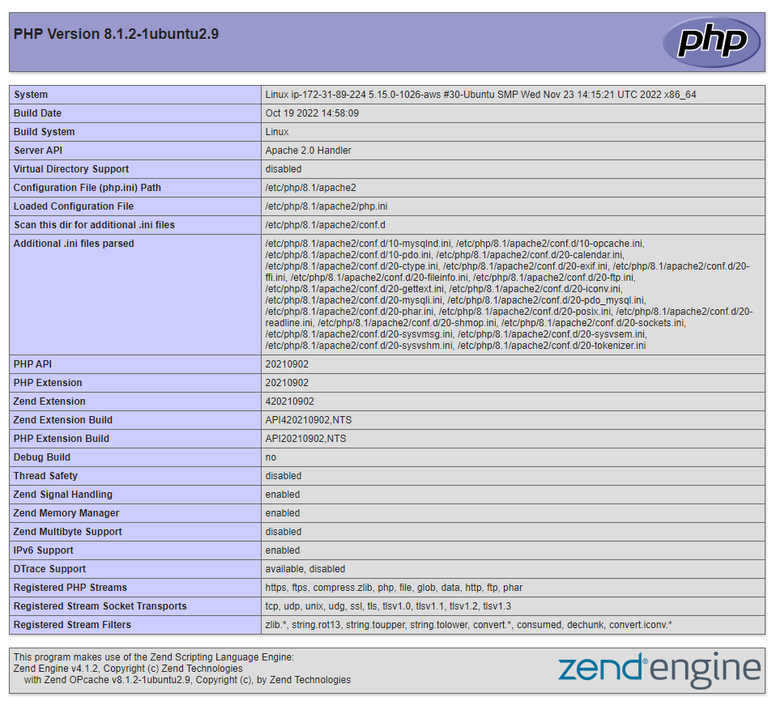

This page provides information about your server from the perspective of PHP. It is useful for debugging and to ensure that your settings are being applied correctly.

If you can see this page in your browser, then your PHP installation is working as expected.
After checking the relevant information about your PHP server through that page, it’s best to remove the file you created as it contains sensitive information about your PHP environment -and your Ubuntu server. You can use rm to do so:

`sudo rm /var/www/projectlamp/index.php`

You can always recreate this page if you need to access the information again later.


